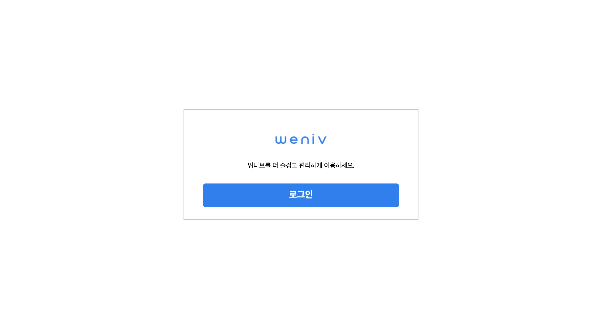

# 로그인 구현실습




구현페이지:https://hun-se.github.io/login_modal/index.html

## 배운점

    1.input에 가상클래스 after를 사용하고 싶었지만 닫는태그가 없는 요소에는 가상클래스를 사용할 수 없다는 걸 알게됐다.

    2. float을 적용하면 inline-block요소가 된다.

    3. [class^="link"]를 사용하여 link로 시작하는 클래스 들을 선택자로 사용하는 법을 알게됐다.

    4. css sprites를 사용한 디자인용 이미지 적용하는 방법을 알게 됐다. 또한 css sprites를 사용하면 저장해야하는 이미지 수가 줄어 편리하고 랜더링 속도가 빨라진다는 장점이 있다.

    5. outline을 사용하면 레이아웃의 영향을 주지 않게 테두리를 그려줄 수 있다. outline-offset으로 아웃라인과 요소 사이의 거리를 조절 할 수 있다.

    6. input요소에는 사용자가 어떤 input인지 알 수 있도록 항상 label을 달아주고 ui에 불필요하다면 숨겨준다.

    7. 로고이미지에 로고라는 추상적인 정보 보다는 구체적인 정보를 적어주기

    8. 업데이트가 잦은 이미지들은 스프라이트 기법을 사용하는것을 피한다.

    9. 닫기 버튼을 가장 마지막 요소로 넣어주고 position으로 위치 잡기(스크린리더기로 읽었을 떄 닫기가 마지막에 나오는게 사용성이 좋기 때문이다.)

    10. 자주쓰는 요소들은 모듈화하여 만들어 놓기

- image sprites 사용법 강의:
  https://www.youtube.com/watch?v=fKyLCIqWjIY&t=270s

- css sprites generator: https://www.toptal.com/developers/css/sprite-generator/

## 2022.04.18 수정상항

- 로고와 같이 정보가 있는 이미지에는 alt값을 주어 자세한 정보를 표시해 주었다.

  ```html
  <h1>
    
  </h1>
  ```

- 반면에 정보가 필요없거나 겹치는 설명이 있는 alt값에는 alt값을 생략해 주었다.

- 요소의 height값을 없에고 요소의 컨텐츠 높이에 변화를 주어 높이값을 설정했다.

- 회원가입과 아이디비밀번호 찾기 사이에 구분선을 만들어 주었다.

  
  ```css
  .line::after {
    content: "\007c";
  }
  ```

- input요소에 라벨을 추가해주었다.

  ```html
  <label for="input-id" class="blind">아이디</label>
  <input
    class="login-id"
    type="text"
    id="input-id"
    name="id"
    placeholder="아이디"
  />
  <label for="input-pw" class="blind"></label>
  <input
    class="login-pw"
    type="password"
    id="input-pw"
    name="pw"
    placeholder="비밀번호"
  />
  ```

- label에 백그라운드 이미지를 주고 label에 가상선택자 before과 checked를 사용해서 로그인유지 체크박스 변화를 주었다.

- 모듈추가
